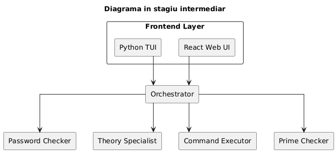
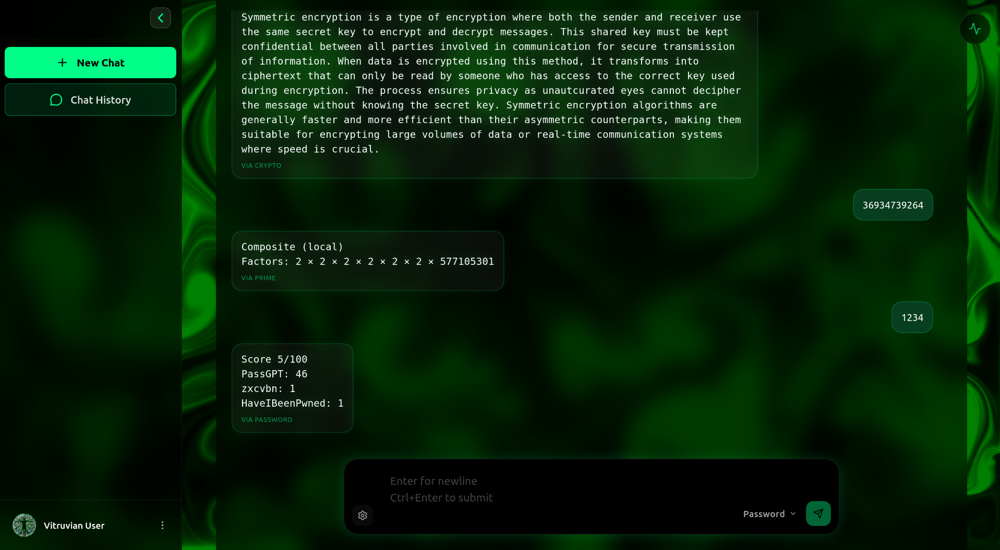
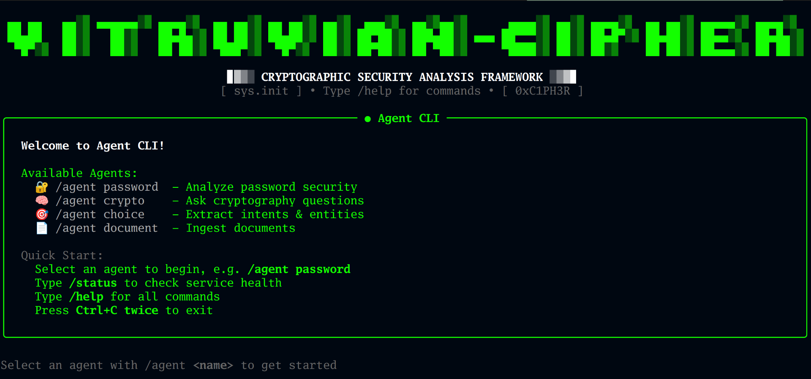
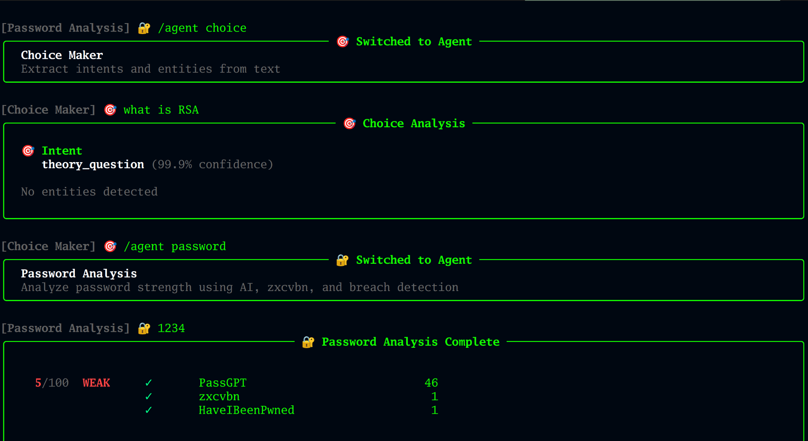

<div align="center">

  # VITRUVIAN CIPHER

  ### *Next-Generation Cryptographic Intelligence Platform*

  [](https://github.com/MoldoAndr/vitruvian-cipher)
  [](LICENSE)
  [](https://github.com/MoldoAndr/vitruvian-cipher)

  **An autonomous multi-agent system powered by specialized AI, cryptanalysis engines, and quantum-resistant cryptography**

  [Features](#-core-capabilities) • [Quick Start](#-quick-start) • [Architecture](#-architecture) • [API Docs](#-api-endpoints) • [Contributing](#-contributing)

</div>

<div align="center" style="width: 500px; max-width: 100%; margin: 0 auto;">

</div>

---

## Overview

**Vitruvian Cipher** is a cutting-edge cryptographic intelligence platform that orchestrates specialized AI agents to deliver enterprise-grade security analysis, password auditing, prime factorization, and cryptographic theory assistance. Built on a polyglot microservices architecture (Rust, Go, Python), it combines machine learning ensemble models, RAG-based knowledge systems, and post-quantum cryptographic operations into a unified, intelligence-driven platform.

> **Vision**: Democratizing advanced cryptography through autonomous AI agents and real-time threat intelligence

---

##  Core Capabilities

###  **Password Intelligence Suite**
- **Multi-Model Ensemble**: Aggregates predictions from PassGPT (neural language model), PassStrengthAI (CNN), zxcvbn (heuristic), and HIBP pwned database
- **Real-Time Breach Detection**: Cross-references against 12B+ compromised credentials via HaveIBeenPwned API
- **Adaptive Strength Scoring**: Normalizes diverse scoring algorithms into unified 0-100 security metric
- **Actionable Recommendations**: Context-aware security improvements based on ML-driven pattern analysis

###  **Prime Factorization Engine**
- **YAFU Integration**: Leverages Yet Another Factorization Utility for advanced number theory operations
- **FactorDB Fallback**: Augments local computation with distributed factorization database
- **Semantic Number Recognition**: Extracts and validates prime candidates from natural language input
- **Performance Optimization**: Concurrent execution with semaphore-based resource management

###  **Theory Specialist RAG System**
- **Local Knowledge Base**: Embeddings-powered retrieval using ONNX models (no external API dependency)
- **Document Ingestion Pipeline**: Automated PDF/text parsing with chunking, vectorization, and storage
- **Semantic Search**: ChromaDB-backed similarity search with cross-encoder reranking
- **Conversation Memory**: Context-aware Q&A with full conversation history tracking

###  **Command Executor (Rust)**
- **Cryptographic Operations**: AES, RSA, HMAC, SHA hashing, and post-quantum cryptography (PQC) via OpenSSL
- **Type-Safe Execution**: Memory-safe command execution with comprehensive validation
- **Timeout Enforcement**: Per-operation timeout controls to prevent resource exhaustion
- **Input Sanitization**: Multi-layer validation (length, charset, algorithm allowlists)

###  **Choice Maker (NLP Engine)**
- **Intent Classification**: Fine-tuned SecureBERT for understanding user cryptographic queries
- **Entity Recognition**: Named entity recognition for extracting numbers, algorithms, and parameters
- **Dynamic Routing**: Intelligently dispatches requests to appropriate specialist agents

###  **Unified Orchestrator**
- **Service Mesh**: Go-based orchestration layer managing all agent lifecycles
- **Health Monitoring**: Real-time health checks with automatic failover
- **Request Multiplexing**: Parallel execution of independent operations with response aggregation
- **LLM Integration**: Pluggable LLM providers (Ollama, OpenAI, Gemini, Anthropic)

---

##  Architecture
<div align="center" style="width: 700px; max-width: 100%; margin: 0 auto;">

</div>

---

##  Interface Preview


<div align="center" style="width: 700px; max-width: 100%; margin: 0 auto;">
  
  <em>Startup interface</em>
  
  <br>
  <em>RAG-powered cryptographic knowledge assistant delivering context-aware answers from ingested research papers and documentation</em>
  
  <br>
  <em>Terminal-based CLI interface for quick access to core functionalities</em>
  
  <em>Password strength analysis with multi-model ensemble and breach detection and intent extranction using Machine Learning Fine-Tuned Models</em>
</div>

---

##  Quick Start

### Prerequisites
- Docker 24+ & Docker Compose 2.20+
- Python 3.11+ (for local development)
- Node 18+ (for frontend development)
- Ollama (optional, for local LLM)

### One-Command Deployment

```bash
# Clone the repository
git clone https://github.com/MoldoAndr/vitruvian-cipher.git
cd vitruvian-cipher

# Launch entire platform
./run_all.sh start

# Access the dashboard
open http://localhost:5173
```

### Individual Service Commands

```bash
# Build all services
./run_all.sh build

# Health check
curl http://localhost:8200/health  # Orchestrator
curl http://localhost:9000/health  # Password Checker
curl http://localhost:8100/health  # Theory Specialist
curl http://localhost:8085/health  # Command Executor
curl http://localhost:5000/health  # Prime Checker

# View logs
./run_all.sh logs

# Stop all services
./run_all.sh stop
```

---

##  API Endpoints

### Password Intelligence
```bash
# Analyze password strength
curl -X POST http://localhost:9000/score \
  -H "Content-Type: application/json" \
  -d '{"password": "MyS3cur3P@ssw0rd!"}'

# Response
{
  "password": "MyS3cur3P@ssw0rd!",
  "strength": 87,
  "scores": {
    "pass_gpt": 0.92,
    "zxcvbn": 3,
    "pass_strength_ai": 85,
    "hibp_breached": false
  },
  "recommendations": ["Consider adding a number", "Length is good"]
}
```

### Prime Factorization
```bash
# Check primality and factorize
curl -X POST http://localhost:5000/isprime \
  -H "Content-Type: application/json" \
  -d '{"number": "123456789012345678901234567891"}'

# Response
{
  "number": "123456789012345678901234567891",
  "is_prime": false,
  "factors": ["123456789012345678901234567891", "7", "13", "..."],
  "method": "yafu",
  "compute_time_ms": 234
}
```

### Theory Specialist (RAG)
```bash
# Query cryptographic knowledge base
curl -X POST http://localhost:8100/generate \
  -H "Content-Type: application/json" \
  -d '{
    "query": "How does AES-GCM differ from AES-CBC?",
    "conversation_id": "conv-123"
  }'

# Response
{
  "answer": "AES-GCM provides authenticated encryption...",
  "sources": [
    {"document": "NIST SP 800-38D", "relevance": 0.94},
    {"document": "cryptography_textbook.pdf", "relevance": 0.87}
  ],
  "conversation_id": "conv-123"
}
```

### Command Executor
```bash
# Execute cryptographic operation
curl -X POST http://localhost:8085/execute \
  -H "Content-Type: application/json" \
  -d '{
    "operation": "symmetric/encrypt",
    "algorithm": "aes-256-gcm",
    "plaintext": "Secret message",
    "password": "strong-key-123"
  }'
```

---

##  Technology Stack

| Component | Technology | Purpose |
|-----------|------------|---------|
| **Frontend** | React + TypeScript + Vite + TailwindCSS | Modern, reactive UI |
| **Orchestrator** | Go + Gin + BoltDB | High-performance service mesh |
| **Password AI** | Python + FastAPI + PyTorch + TensorFlow | ML ensemble models |
| **Theory RAG** | Python + FastAPI + ChromaDB + ONNX | Vector search + embeddings |
| **Crypto Engine** | Rust + Axum + OpenSSL | Type-safe cryptographic operations |
| **Prime Analysis** | Go + YAFU + FactorDB API | Number theory computations |
| **Database** | PostgreSQL 16 + Redis 7 | Persistence and caching |
| **Containerization** | Docker + Docker Compose | Microservices orchestration |
| **Observability** | Prometheus + Grafana *(optional)* | Metrics and monitoring |

---

##  Project Structure

```
vitruvian-cipher/
├── code/
│   ├── agents/                    # AI-powered microservices
│   │   ├── password_checker/      # ML ensemble password analysis
│   │   ├── theory_specialist/     # RAG-based Q&A system
│   │   ├── choice_maker/          # NLP intent classification
│   │   ├── command_executor/      # Rust cryptographic operations
│   │   ├── prime_checker/         # Go factorization engine
│   │   └── orchestrator/          # Go service orchestration
│   ├── interface/
│   │   ├── react_interface/       # Production React UI
│   │   └── cli/                   # CLI interface
│   ├── docker-compose.yml         # Multi-service orchestration
│   ├── run_all.sh                 # Unified deployment script
│   └── GUIDELINES/                # Architecture & security docs
├── logo/                          # Screenshots & branding
├── doc/                           # LaTeX thesis documentation
└── README.md
```

---

##  Security Features

- ✅ **Type-Safe Operations**: Rust memory safety for cryptographic primitives
- ✅ **Input Validation**: Multi-layer validation (length, charset, algorithm allowlists)
- ✅ **Timeout Enforcement**: Per-operation resource limits prevent DoS
- ✅ **Environment Isolation**: Containerized services with minimal attack surface
- ✅ **No External API Dependencies**: Fully local execution (except optional HIBP)
- ✅ **Audit-Ready**: Structured logging for all cryptographic operations

---

##  Roadmap

- [ ] **Hash Breaking Agent** (Celery + Hashcat + PassGAN integration)
- [ ] **Cryptosystem Detection** (CyberChef + dcode.fr heuristic engine)
- [ ] **Post-Quantum Cryptography** (Full implementation of Kyber, Dilithium)
- [ ] **Advanced Authentication** (JWT + OAuth2 + API key management)
- [ ] **Real-Time Collaboration** (WebSocket-based multi-user sessions)
- [ ] **Export Capabilities** (PDF reports, JSON exports, API integrations)

---

##  Acknowledgments

- **YAFU** - Yet Another Factorization Utility
- **FactorDB** - Distributed factorization database
- **HaveIBeenPwned** - Pwned password API
- **SecureBERT** - Pre-trained security NLP model
- **ChromaDB** - Open-source embedding database
- **Ollama** - Local LLM inference engine

---

<div align="center">

  **Built with ❤️ for the cryptography community**

  [](https://github.com/MoldoAndr/vitruvian-cipher)
  [](https://github.com/MoldoAndr/vitruvian-cipher/fork)

</div>
