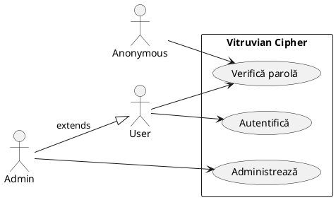
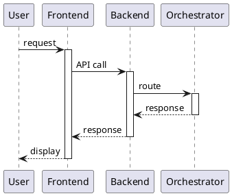
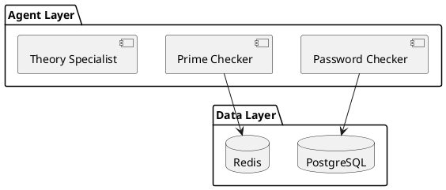

# 📋 TODO - Diagrame UML pentru SRS Vitruvian Cipher

**Ultima actualizare:** 2 Ianuarie 2026  
**Total diagrame necesare (minim):** 11  
**Existente (UML, 1 opțională):** 5  
**De creat (minim):** 7  
**De actualizat:** 4  
**Opționale:** 2

---

## 📚 Referințe Cursuri UML (Prof. Mihai Togan)

### Tipuri de Diagrame UML Relevante pentru Proiect

| Tip Diagramă | Categorie | Când se folosește | Avem? |
|--------------|-----------|-------------------|-------|
| **Use Case Diagram** | Comportamental | Cerințe funcționale, interacțiuni Actor↔Sistem | ❌ |
| **Sequence Diagram** | Comportamental | Interacțiuni temporale între obiecte/componente | ❌ |
| **Component Diagram** | Structural | Componentele sistemului și legăturile între ele | ✅ |
| **Deployment Diagram** | Structural | Structura hardware/software și distribuție | ❌ |
| **Class Diagram** | Structural | Clase, atribute, metode, relații | ❌ (opțional) |
| **Activity Diagram** | Comportamental | Fluxuri de activități | ❌ (opțional) |
| **State Diagram** | Comportamental | Lifecycle pentru obiecte/fluxuri | ❌ (opțional) |

### Reguli UML din Cursuri

**Use Case Diagram:**
- Actor = entitate externă (utilizator, sistem extern) - notație: omuleț
- Use Case = funcționalitate - notație: elipsă cu nume verbal
- NU există interacțiuni directe între actori!
- Relații: `<<include>>`, `<<extend>>`, generalizare
- Atenție la granularitate (nu prea detaliat, nu prea abstract)

**Sequence Diagram:**
- Linie de viață verticală (linie întreruptă)
- Bandă de activare (dreptunghi pe linia de viață)
- Mesaj sincron: săgeată cu vârf plin →
- Mesaj asincron: săgeată cu vârf deschis ⟶
- Răspuns: linie întreruptă ← - -
- Fragment combinat: `alt`, `opt`, `loop`, `par`

**Component Diagram:**
- Componentă = dreptunghi cu pictograma componentei (2 dreptunghiuri mici)
- Interfață provided: cerc plin ○
- Interfață required: semicercul ◐
- Dependență: linie întreruptă cu săgeată `-->`
- Stereotipuri: `<<service>>`, `<<database>>`, `<<library>>`

**Deployment Diagram:**
- Nod = cub 3D (server, dispozitiv, container)
- Artefact = dreptunghi în interiorul nodului
- Asociere de comunicare: linie continuă

---

## ✅ Diagrame Existente (Verificate vs. Cursuri)

| # | Fișier | Tip | Conformitate UML | Probleme |
|---|--------|-----|------------------|----------|
| 1 | `diagrama_arhitectura_generala.uml` | Component | ⚠️ Parțial | Lipsesc Data Layer și lista completă de agenți; separare Backend/Orchestrator neclară |
| 2 | `diagarama_theory_specialist.uml` | Component | ⚠️ Parțial | Clarifică stocarea (ChromaDB + documente) și providerii LLM |
| 3 | `diagarama_choice_maker_make_choice.uml` | Component | ✅ OK | Menține focus pe inferență (runtime) |
| 4 | `diagarama_choice_maker_generate_questions.uml` | Component | ⚠️ Parțial | Diagrama de training este opțională; mută în anexă AI/ML |
| 5 | `diagarama_password_checker.uml` | Component | ⚠️ Parțial | Lipsește PassGPT și marcarea HIBP ca dependență externă |

### Observații Generale pentru Diagramele Existente:

1. **Folosesc `rectangle` în loc de `package`** - grupările logice ar trebui să fie package-uri
2. **Notația pentru componente** - preferă component/pictogramă explicită
3. **Conexiunile sunt OK** - folosesc `-->` pentru dependențe
4. **Stilizarea PlantUML** - acceptabilă, dar păstrează UML curat pentru evaluare

Notă: fișierele `_4_IP_nou.ppt.pdf` și `_5_IP.ppt.pdf` sunt slide-uri, nu diagrame UML.

---

## ⚠️ Diagrame de Actualizat

### 1. `diagrama_arhitectura_generala.uml`
**Status:** Necesită actualizare majoră

**Probleme identificate:**
- ❌ Lipsesc Data Layer (PostgreSQL/Redis/ChromaDB) și agentul Cryptosystem Detection
- ⚠️ Separarea Backend API vs Orchestrator nu este clară
- ⚠️ Lipsesc trust boundaries (se pot muta într-o diagramă separată)

**Acțiune:** Actualizează la 7 agenți + data layer, cu package-uri UML și legături clare.

---

### 2. `diagarama_password_checker.uml`
**Status:** Necesită completare

**Probleme identificate:**
- ❌ Lipsește: PassGPT (FR-PWD-002)
- ⚠️ HIBP trebuie marcat ca dependență externă

**Acțiune:** Adaugă PassGPT și marchează HIBP API ca extern.

---

### 3. `diagarama_theory_specialist.uml`
**Status:** Necesită aliniere

**Probleme identificate:**
- ⚠️ Clarifică stocarea documentelor și ChromaDB
- ⚠️ Clarifică LLM providers (local/extern)

**Acțiune:** Ajustează componentele pentru flux RAG final.

---

### 4. `diagarama_choice_maker_generate_questions.uml`
**Status:** Opțional

**Probleme identificate:**
- ⚠️ Diagrama de training nu este parte din fluxul runtime

**Acțiune:** Păstrează doar dacă incluzi secțiune AI/ML dedicată în SRS (anexă).

---

## 🆕 Diagrame de Creat

### 1. `diagrama_prime_checker.uml`
**Tip:** Component Diagram  
**Prioritate:** 🔴 RIDICATĂ

**Componente necesare:**
```
Input → API
        ↓
┌─────────────────────────────┐
│ Orchestrare                 │
│ - Router                    │
│ - Cache Manager (BoltDB)    │
└─────────────────────────────┘
        ↓
┌─────────────────────────────┐
│ Backend-uri                 │
│ - Miller-Rabin (local)      │
│ - YAFU (local)              │
│ - FactorDB (extern)         │
└─────────────────────────────┘
        ↓
Output (factors, method, time)
```

---

### 2. `diagrama_command_executor.uml`
**Tip:** Component Diagram  
**Prioritate:** 🔴 RIDICATĂ

**Componente necesare:**
```
Input → API (Rust)
        ↓
┌─────────────────────────────┐
│ Validator                   │
│ - Input sanitization        │
│ - Command allowlist         │
└─────────────────────────────┘
        ↓
┌─────────────────────────────┐
│ Crypto Operations           │
│ - Encoding (Base64, Hex)    │
│ - Hashing (SHA, BLAKE2)     │
│ - Symmetric (AES-CBC)       │
│ - Asymmetric (RSA-OAEP)     │
│ - PQC (ML-DSA, Falcon)      │
└─────────────────────────────┘
        ↓
OpenSSL 3.x + oqsprovider
```

---

### 3. `diagrama_cryptosystem_detection.uml`
**Tip:** Component Diagram  
**Prioritate:** 🟡 MEDIE

**Componente necesare:**
```
Input (ciphertext) → API
                     ↓
┌─────────────────────────────┐
│ Detectori                   │
│ - CyberChef Magic           │
│ - Euristici dcode.fr        │
│ - Pattern matchers          │
└─────────────────────────────┘
                     ↓
┌─────────────────────────────┐
│ Aggregator                  │
│ - Score fusion              │
│ - Ranking                   │
└─────────────────────────────┘
                     ↓
Output (top N candidates + scores)
```

---

### 4. `diagrama_deployment_k8s.uml`
**Tip:** Deployment Diagram  
**Prioritate:** 🔴 RIDICATĂ

**Componente necesare:**
- Ingress/API Gateway
- Backend Go (Auth/Rate limit/Audit)
- Orchestrator
- Agent pool (PWD/PRM/RAG/CMD/NLP/CRY)
- Data layer (PostgreSQL, Redis, ChromaDB)
- Observabilitate (Prometheus/Grafana/Log stack)
- Secrets management

---

### 5. `diagrama_trust_boundaries.uml`
**Tip:** Deployment Diagram cu Trust Boundaries  
**Prioritate:** 🔴 RIDICATĂ (pentru Threat Model)

**Structură necesară:**
```
Zone (de sus în jos):
1. ZONĂ EXTERNĂ [untrusted] - Browser, CLI, API Consumers
   ─── GÎ1: Internet ─── (TLS, WAF)
2. ZONĂ DMZ - WAF/Proxy, Frontend React
   ─── GÎ2: DMZ/Aplicație ─── (Auth)
3. ZONĂ APLICAȚIE - Backend Go, Orchestrator
   ─── GÎ3: Aplicație/Agenți ─── (mTLS)
4. ZONĂ AGENȚI [isolated] - 6 agenți (PWD/PRM/RAG/CMD/NLP/CRY)
   ─── GÎ4: Agenți/Date ─── (credentials)
5. ZONĂ DATE [restricted] - PostgreSQL, Redis, ChromaDB
6. DEPENDENȚE EXTERNE - HIBP, FactorDB, LLM APIs
```

**Culori sugerate:**
- Zonă Externă: roșu deschis
- DMZ: portocaliu
- Aplicație: galben
- Agenți: verde
- Date: albastru
- Externe: gri

---

### 6. `diagrama_sequence_request_flow.uml`
**Tip:** Sequence Diagram (conform Curs UML)  
**Prioritate:** 🔴 RIDICATĂ

**Participanți și flux (generic):**
```
User -> Frontend -> Backend -> Orchestrator -> ChoiceMaker -> Agent -> Orchestrator -> Backend -> Frontend
```

---

### 7. `diagrama_use_case.uml`
**Tip:** Use Case Diagram  
**Prioritate:** 🔴 RIDICATĂ

**Actori identificați (din SRS):**
- Anonymous
- User
- Admin
- External API Consumer

**Use Case-uri principale:**
```
Verifică parolă
Factorizează număr prim
Întreabă teorie criptografică
Execută operație criptografică
Detectează criptosistem
Autentifică utilizator
Gestionează cont
Administrează utilizatori (Admin)
Administrează API keys (Admin)
Vizualizează audit logs (Admin)
```

---

## 🟡 Diagrame opționale (dacă ai timp)

### 1. `diagrama_activity_async_jobs.uml`
**Tip:** Activity Diagram  
**Scop:** Flux asincron pentru operații heavy (factorizare, RAG extins)

### 2. `diagrama_state_job_lifecycle.uml`
**Tip:** State Diagram  
**Scop:** Lifecycle job (queued → running → completed/failed → archived)

---

## 📊 Sumar Prioritizat (Actualizat conform Cursuri)

| Prioritate | Diagramă | Tip UML | Estimare |
|------------|----------|---------|----------|
| 🔴 RIDICATĂ | `diagrama_use_case.uml` | Use Case | 30 min |
| 🔴 RIDICATĂ | `diagrama_sequence_request_flow.uml` | Sequence | 30 min |
| 🔴 RIDICATĂ | `diagrama_trust_boundaries.uml` | Deployment | 30 min |
| 🔴 RIDICATĂ | `diagrama_deployment_k8s.uml` | Deployment | 30 min |
| 🔴 RIDICATĂ | `diagrama_prime_checker.uml` | Component | 15 min |
| 🔴 RIDICATĂ | `diagrama_command_executor.uml` | Component | 20 min |
| 🟡 MEDIE | `diagrama_cryptosystem_detection.uml` | Component | 15 min |
| ⚠️ UPDATE | `diagrama_arhitectura_generala.uml` | Component | 20 min |
| ⚠️ UPDATE | `diagarama_password_checker.uml` | Component | 10 min |
| ⚠️ UPDATE | `diagarama_theory_specialist.uml` | Component | 10 min |
| ⚠️ OPTIONAL | `diagarama_choice_maker_generate_questions.uml` | Component | 10 min |
| ⚠️ OPTIONAL | `diagrama_activity_async_jobs.uml` | Activity | 20 min |
| ⚠️ OPTIONAL | `diagrama_state_job_lifecycle.uml` | State | 15 min |

**Timp total estimat (fără opționale):** ~3.5 ore
**Timp total estimat (cu opționale):** ~4.5 ore

---

## 📝 Sintaxă PlantUML Corectă (conform UML standard)

### Use Case Diagram


### Sequence Diagram


### Component Diagram (corect)


---

## 🛠️ Tool-uri Recomandate

- **PlantUML** (recomandat - deja folosit în proiect)
- **Draw.io** (alternativă vizuală)
- **Mermaid** (pentru Markdown inline)
- **Lucidchart** (colaborare)

## 📁 Convenție Denumire

```
diagrama_<tip>_<subiect>.uml

Exemple:
- diagrama_usecase_principal.uml
- diagrama_sequence_autentificare.uml
- diagrama_component_hash_breaker.uml
- diagrama_deployment_productie.uml
```

---

*Acest document trebuie actualizat pe măsură ce diagramele sunt completate.*
